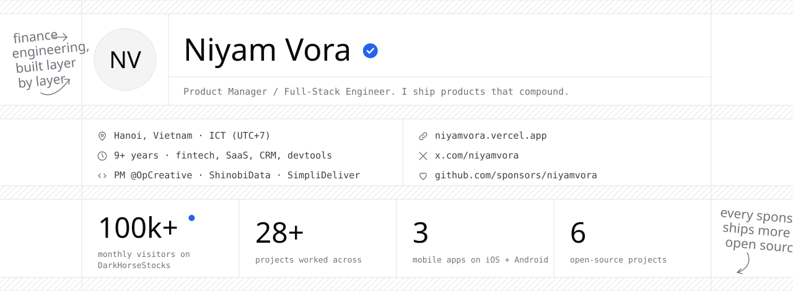
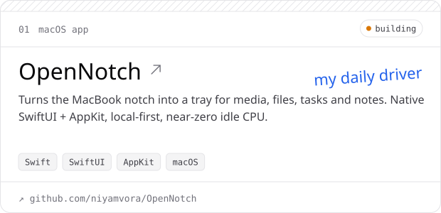
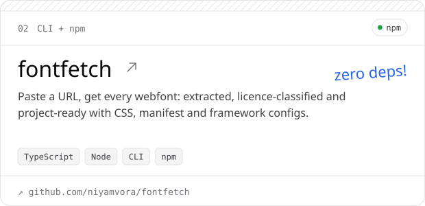
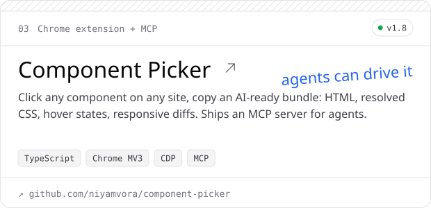
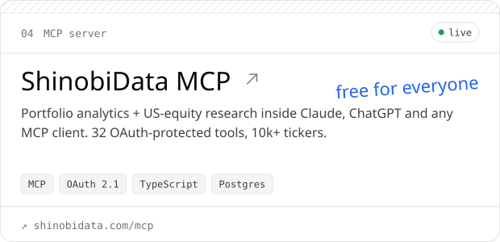
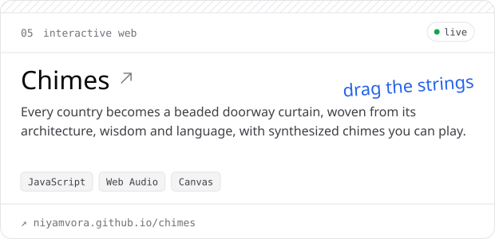
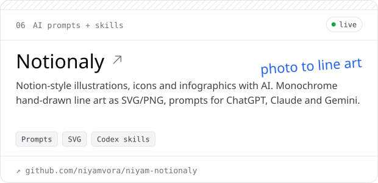
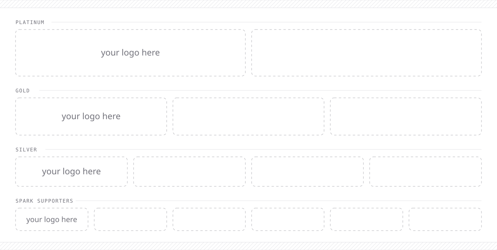

<!-- GitHub Sponsors profile — preview. Art is generated by gen.py (light + dark). -->

<picture>
  <source media="(prefers-color-scheme: dark)" srcset="banner-dark.svg">
  
</picture>

<p align="center">
  <a href="https://niyamvora.vercel.app">Portfolio</a> ·
  <a href="https://x.com/niyamvora">X</a> ·
  <a href="https://www.linkedin.com/in/niyam-vora-1b7411333/">LinkedIn</a> ·
  <a href="https://github.com/niyamvora">GitHub</a> ·
  <a href="mailto:niyamvora@gmail.com">Email</a>
</p>

### Hi, I'm Niyam 👋

I spent 9+ years as a product manager in fintech, SaaS and CRM. I grew **DarkHorseStocks** to 64,000+ users, then learned to build the whole product myself, from schema to storefront.

Now I open-source the tools I build for my own work: a native **macOS notch app**, a **webfont extractor**, a **component picker that AI agents can drive**, and a **free MCP server for equity research**. Your sponsorship keeps them **free, maintained, and shipping**.

<picture>
  <source media="(prefers-color-scheme: dark)" srcset="divider-dark.svg">
  
</picture>

## What you're funding

<table>
  <tr>
    <td width="50%"><a href="https://github.com/niyamvora/OpenNotch"><picture><source media="(prefers-color-scheme: dark)" srcset="card-opennotch-dark.svg"></picture></a></td>
    <td width="50%"><a href="https://github.com/niyamvora/fontfetch"><picture><source media="(prefers-color-scheme: dark)" srcset="card-fontfetch-dark.svg"></picture></a></td>
  </tr>
  <tr>
    <td width="50%"><a href="https://github.com/niyamvora/component-picker"><picture><source media="(prefers-color-scheme: dark)" srcset="card-component-picker-dark.svg"></picture></a></td>
    <td width="50%"><a href="https://shinobidata.com/mcp"><picture><source media="(prefers-color-scheme: dark)" srcset="card-shinobidata-mcp-dark.svg"></picture></a></td>
  </tr>
  <tr>
    <td width="50%"><a href="https://niyamvora.github.io/chimes/"><picture><source media="(prefers-color-scheme: dark)" srcset="card-chimes-dark.svg"></picture></a></td>
    <td width="50%"><a href="https://github.com/niyamvora/niyam-notionaly"><picture><source media="(prefers-color-scheme: dark)" srcset="card-notionaly-dark.svg"></picture></a></td>
  </tr>
</table>

**Quick installs**

```bash
npx fontfetch https://stripe.com                             # every webfont, project-ready
claude mcp add component-picker -- npx component-picker-mcp  # let your agent pick components
```

ShinobiData MCP: in Claude or ChatGPT, go to **Settings → Connectors → Add custom** and paste `https://mcp.shinobidata.com/api/mcp/mcp`. It's free, and you sign in with OAuth.

## Also shipped (commercial, closed source)

| Product | What it does |
| --- | --- |
| **[ShinobiData](https://shinobidata.com)** | Bloomberg-style equity research. 10k+ tickers, 200+ screener fields, sub-50 ms filters |
| **[SimpliDeliver](https://www.simplideliver.com)** | Multi-channel CRM. WhatsApp, Instagram, Messenger and Zalo in one inbox, with in-chat payments |
| **[SimpliDeliver Email](https://simplideliver.com/email/)** | Transactional email on AWS SES, with a REST API, event pipeline, BYODKIM and an [npm SDK](https://www.npmjs.com/package/simplideliver-email) |
| **[OpCreative](https://opcreative.us)** | Print-on-demand fulfillment platform, with a zero-downtime cutover from the legacy system |
| **[DarkHorseStocks](https://www.darkhorsestocks.in)** | Subscription stock research for 64k+ Indian retail investors, plus a real-time markets terminal |
| **Enigma** | Privacy-first messenger with an MLS end-to-end encryption tier and one Rust crypto core for iOS and Android |

<picture>
  <source media="(prefers-color-scheme: dark)" srcset="divider-dark.svg">
  
</picture>

## Where your sponsorship goes

| | Cost | Unlocks |
| --- | --- | --- |
| 🍎 Apple Developer Program | $99 / year | Signed and notarized OpenNotch builds: no Gatekeeper warning, Sparkle auto-updates |
| 🧩 Chrome Web Store listing | $5 once | One-click install for Component Picker (today it's a manual unpacked install) |
| ☁️ Hosting | ~$20 / month | Keeping ShinobiData MCP free, and launching the fontfetch web app |
| ⏱️ **Time** | **goal: $1,000 / month** | **One full day every week on open source: issues, releases, new tools** |

## Tiers

| | Backer | Spark Supporter | Silver | Gold | Platinum |
| --- | :---: | :---: | :---: | :---: | :---: |
| **Price** | $10 once | $20 once | $20 / mo | $50 / mo | $200 / mo |
| Thank-you shoutout on [X](https://x.com/niyamvora) | ✓ | ✓ | monthly | monthly | monthly |
| Name / logo on the sponsor wall |  | ✓ | ✓ | ✓ | ✓ |
| Logo in every project README + backlink |  |  | ✓ | ✓ | ✓ |
| Highlighted placement |  |  |  | ✓ | top spot |
| Priority on your issues & feature requests |  |  |  | ✓ | ✓ |
| Monthly 30-min call: product, AI, MCP |  |  |  |  | ✓ |
| Private support by email |  |  |  |  | ✓ |

Companies can sponsor too. GitHub issues invoices, and one-time sponsorships are always welcome.

## Sponsors

<picture>
  <source media="(prefers-color-scheme: dark)" srcset="wall-dark.svg">
  
</picture>

<p align="center"><b>Every sponsorship, big or small, goes straight into shipping more open source. Thank you. 🙏</b></p>
